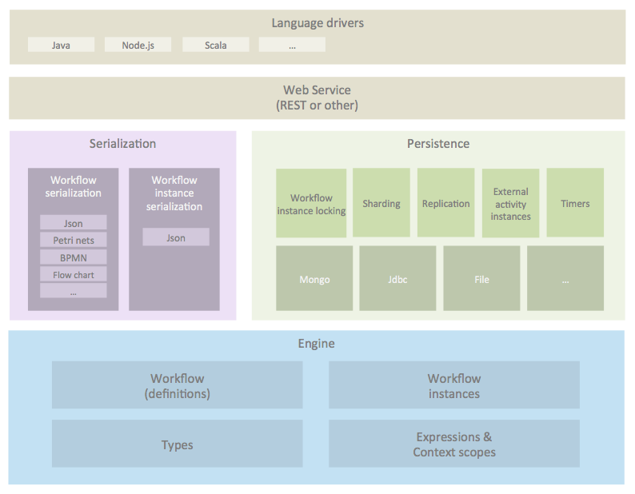

# Principles of Workflow Engines

Every self-respecting developer has written a workflow engine in their life.  I have a lot of self respect :)

This is an effort to collect and share my knowledge on design principles for implementing workflow 
engines.  This repo is a scratchpad in which I am starting to collect and document ideas.  It might 
end up as a series of blog posts or a book.

# Introduction

  * What is a workflow engine
    * A software system that can execute graphs
    * https://en.wikipedia.org/wiki/Business_Process_Model_and_Notation
    * https://en.wikipedia.org/wiki/Flowchart
    * https://en.wikipedia.org/wiki/Petri_net
  * What's it used for
    * Business process management
    * Rapid prototyping
    * Coordinate usertasks
    * Combine user tasks and enterprise integrations
  * More generic description of a workflow:
    * Graph based diagram
    * Represents an execution flow
    * Async continuations (the execution flow may go outside the engine's control.
      activities may have to wait till the external service passes the execution 
      flow back to the engine)
  * What's so hard about it? 
    * Programming languages can't wait
    * Persistence during asynchronous continuations
    * Resume execution flow
    * Graph based
    * Observation: Workflow execution is always non blocking (kinda like reactive programming)
      Cause if it would be blocking, that means you have to introduce an asynchronous continuation. 

# Workflow engine concepts

  * Minimal workflow engine as an example
    * Tail recursion (call stack) vs atomic operations --> new minimal version (ch01.2) with atomic operations?
  * Workflow models
    * Activity composition
    * Activity configuration
    * Transitions
    * Workflow templates  
    * Start logic
    * Listeners?
  * Types of activities
    * Control flow activities
    * Functional activities (aka side effects)
    * Combinations of control flow and functional activities
  * Workflow instance models
    * Activity instance composition
    * Token / execution based approach
    * Equivalence of Activity instance composition and token hierarchy.

# Control flow 

  * Mostly transitions are used to specify control flow
  * Data availability interrupting control flow
  * Exception handling
    * Programming language level exceptions occur because of bugs, unvailability of services, wrong workflow configuration, etc
    * Workflow language can define it's own exception handling (like BPMN events) 
    * Programming language level exceptions, but also plain code logic can lead to workflow language exceptions
    * Programming language level exceptions might be handled by logging (see below) and then parking the workflow instance into an error state so that an admin can intervene. 

# Activities

  * Each 'language' has it's own set of activities
  * Types
    * Control flow activities are those that control the flow :)
    * Functional activities typically perform an operatino on an external system or service
    * Mixed: Sometimes activities combine functional behavior and control flow (eg all BPMN activities perform a fork at the end) 
  * Engine must have a generic activity pluggability, no distinction between control flow and functional activities
  * Functional activity pluggability
  * UI pluggability requires a lot of information
    * Name, description, icon 
    * A description of the configuration options.  UI will produce a config form.
    * A description of the input/output parameters.
    * Type descriptors for input/output parameters for expression dereferencing
    * Workflow variables become like an ESB
  * Logging
    * Activities should be able to add logging for debugging, runtime trouble shooting

# Concurrency aspects

  * The thread of the client can be used to execute (=interpret) the workflow
    * Tradeoff: duration vs process execution information
    * Process execution information example: which tasks have been created
    * Alternative: Futures
  * Activity asynchronous options
    * Synchronous/Asynchronous start of the activity
    * Asynchronous start used for external services that take too long for 
      the client request to wait. The external service invocation can be 
      the actual work, or it can be a notifications that eventually will trigger a callback
    * Is there an incoming external signal that continues the workflow execution flow
  * Asynchronous continuations
  * Message queues are an implementation technique
    * Relation to transactions
  * Activity categories
    * Synchronous, internal activities
      * In the thread of the client
      * Work being done inside the engine
      * eg control flow activities, assignment
    * Synchronous external activities
      * Starts in the thread of the client
      * Wait state that requires activity instance message to continue
      * eg User Task
    * Asynchronous internal activities
      * Started asynchronous
      * Work being done inside the engine
      * eg JavaScript, Send Email
    * Asynchronous external activities
      * Started asynchronous
      * Wait state that requires activity instance message to continue
      * eg Request-response interaction over message queues
  * Process concurrency vs software concurrency

# Workflow engine data

  * Why workflows mostly require data?
  * Examples
  * References vs inline data
  * Why does a BPM system need it's own typing?
    * which one?  json, java or something else?
    * BPM needs many rich data types like user(reference), file(reference), money etc
    * BPM needs more abstract data types (byte,short.int,long,float,double,...) --> number 
    * expressions
    * conversions
  * Type pluggability (extending the type structure in java)
  * User defined types: data structure for type pluggability
  * Data vs references
  * Dereferencing references vs dereferencing structured, inlined variable data
  * Static variables
  * Expressions: resolving an expression based on a context
  * Hierarchical contexts: scopeInstance context, scope context and external context   
  * Bindings : mapping fixed names to configurable inputs for activities
  * Conditions : boolean expressions used for:
    * Transitions (and to lesser extend activities)
  * Activating activities on conditions
  * Binding message data to triggers and messages
  * Mapping json and xml to data and expressions

# Interacting with external services

  * Activity worker types
    * Hard coded service invocations
      * Can use variables directly
      * Alternative: customizable HTTP request configuration
      * TODO pros/cons
    * Central request list
      * Like a task list for services
      * Data is resolved in the activity and an request is persisted
      * Activity workers perform competing consumers on the request list
      * Activity workers only perform their own logic 
      * TODO pros/cons
    * Full activity workers
      * Each activity worker is a full engine
      * Competing consumers is done directly on the workflow instance
      * Perform external service notifications after saving the new workflow state.
      * When notifying an external service, make sure that the 
        engine does this after the persistence of the current 
        operarations has been completed and persisted.
        Because the external service might be really quick.
        And it might signal before the engine persists the 
        new state.
      * TODO pros/cons
  * Data mapping through parameters/bindings/expressions
  * Generic input and output parameters
    * Activities describe which input and output parameters they have
    * They are implemented like function calls with fixed names for inputs and outputs
    * During process authoring, inputs and outputs are bound to workflow variables  
  * Correlation of the incoming signal with the waiting activity instance: 
    * A workflow-engine-generated reference to the activity instance can be passed to the external service.  the external service then has to pass it back when signalling completion of the external activity.
    * Alternatively, the activity can set business data on the async continuation. (aka correlation data).  That way, the external service doesn't have to have the engine generated reference to the activity id.  But it can find the async continuation based on the business data it already has.

# Workflow engine API

  * deploy a workflow
    * workflow versioning
    * instance migration
    * workflow part of a larger application? 
  * start a workflow instance
  * send a message to signal the end of an activity instance
  * create a new data type dynamically
  * create a new activity type dynamically

# Implementation aspects

  * Multi tenancy: how to layer it on top
  * Access control: how to layer it on top
  * Immutable, serializable workflow instance copies
    * When the workflow instance object is passed for asynchronous work,
      the client should get an immutable, serializable snapshot of the 
      workflow instance.
    * Alternatively an optional visitor could be passed in the engine 
      that walks the workflow instance model before work goes 
      asynchronous.   
  * Persistence
    * Store, load and resume execution
    * Transactional workflow instance state changes
    * Activity side effects 
    * Workflow instance updates vs side effects
    * Non-transactional persistence
      * Saving
    * Consistency (advanced)
      * Keeping the persisted process state in sync with performed side effects
      * Transactional and non transactional side effects
      * Idempotent side effects
    * Dirty checking
    * Change logs
    * Extending the workflow engine model
      * Eg organizationId, access control
      * Separate collections vs generic workflow model extension 
    * Combining change logs with the other approaches
    * Copying the workflow structure in the workflow instance
    * Archiving
  * Collecting analytics
    * Logs (jbpm3, activiti dumping logs in elastic search)
    * Star based relational schema (jbpm4+)
    * Most workflow engines generate statistical reports
    * Some overlap with runtime data structures
    * Depends on the data store
    * Often, runtime data structures are not optimal
    * Duplication  
    * Can be based on listener or transaction logs
  * BPEL style correlation
    * Activity instance correlation for continuation messages (makes sense)
    * Trigger correlation for starting a process based on arbitrary messages (doesn't make sense ==> use an event listener inbetween that listens and converts) 
    
# Building blocks

  * Relational DBs
  * NoSQL DBs
  * Message queues
  * Persistent timers

# Scaling

  * From simplest example: finite state machine persisted as a string field in an entity inside the user's domain model
  * To Facebook scale
  * Challenge: can we build a common basis that works for all these

# Architecture

# Links 

  * http://blog.acolyer.org/2015/09/08/out-of-the-fire-swamp-part-i-the-data-crisis/
  * http://blog.acolyer.org/2015/09/09/out-of-the-fire-swamp-part-ii-peering-into-the-mist/
  * http://pegasus.isi.edu/
  * http://www.taverna.org.uk/
